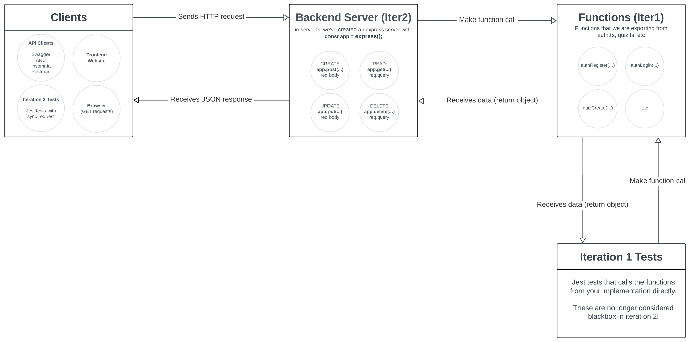

# Tutorial 5

## Getting Started

- What is an API?

Below are some examples of real-world APIs that are publicly available for everyone to use!

- [🎼 Spotify](https://developer.spotify.com/documentation/web-api/reference/#/)
  - and a cool [example](https://everynoise.com/) of how the Spotify API can be used in a project
- [🎥 IMDb](https://imdb-api.com/api)
- [💰 Stocks/Finance](https://finnhub.io/docs/api/introduction)
- [🦎 Pokemon](https://pokeapi.co/)

For a more comprehensive list of free APIs for use in software and web development, see:

- https://github.com/public-apis/public-apis

## A. Express Server Build

Before we get started, here is a diagram that you can reference when transitioning from iteration 1 to iteration 2:

<details close>
<summary>click to view</summary>



</details>

### The Interface

Below is an interface for a basic "people" server:

<details close>
<summary>click to view</summary>

<table>
  <tr>
    <th>Name & Description</th>
    <th>HTTP Method</th>
    <th>Data Types</th>
    <th>Errors</th>
  </tr>
  <tr>
    <td>
      <code>/clear</code><br/><br/>
      Remove all entries from the data store.
    </td>
    <td>
      ???
    </td>
    <td>
      <b>??? Parameters</b><br/>
      <code>{}</code>
      <br/><br/>
      <b>Return Object</b><br/>
      <code>{}</code>
    </td>
    <td>
      N/A
    </td>
  </tr>
  <tr>
    <td>
      <code>/people/add</code><br/><br/>
      Given a name and an age, add the entry into the data store if it is valid.
    </td>
    <td>
        ???
    </td>
    <td>
      <b>??? Parameters</b><br/>
      <code>{name: string, age: number}</code>
      <br/><br/>
      <b>Return Object</b><br/>
      <code>{}</code>
    </td>
    <td>
      Return <code>{ error }</code> with status code 400 when:
      <ul>
        <li>
          The given name is an empty string, <code>""</code>.
        </li>
        <li>
          The given age is not strictly positive.
        </li>
        <li>
          The given name already exists in the data store.
        </li>
      </ul>
    </td>
  </tr>
  <tr>
    <td>
      <code>/people/list</code><br/><br/>
      Return all people that are equal to or older than the given <code>minAge</code>.
      <br/><br/>
      Names should be returned in descending age order (e.g. eldest at index 0),
      or in lexicographical case-insensitive order if the ages are equal.
    </td>
    <td>
        ???
    </td>
    <td>
      <b>??? Parameters</b><br/>
      <code>{minAge: number}</code>
      <br/><br/>
      <b>Return Object</b><br/>
      <code>{ people: Person[] }</code>
    </td>
    <td>
      Return <code>{ error }</code> with status code 400 when:
      <ul>
        <li>
          minAge is strictly negative.
        </li>
      </ul>
    </td>
  </tr>
  <tr>
    <td>
      <code>/person/:peopleid</code><br/><br/>
      Return the name and age of a person that corresponds with the given personid
    </td>
    <td>
      ???
    </td>
    <td>
      <b>??? Parameters</b><br/>
      <code>{}</code>
      <br/><br/>
      <b>Return Object</b><br/>
      <code>{ person: Person }</code>
    </td>
    <td>
      Return <code>{ error }</code> with status code 400 when:
      <ul>
        <li>
          peopleid does not refer to an existing person
        </li>
      </ul>
    </td>
  </tr>
  <tr>
    <td>
      <code>/person/:peopleid</code><br/><br/>
      Edit the age for the given name entry.
    </td>
    <td>
      ???
    </td>
    <td>
      <b>??? Parameters</b><br/>
      <code>{name: string, age: number}</code>
      <br/><br/>
      <b>Return Object</b><br/>
      <code>{}</code>
    </td>
    <td>
      Return <code>{ error }</code> with status code 400 when:
      <ul>
        <li>
          peopleid does not refer to an existing person
        </li>
        <li>
          The new age is not strictly positive.
        </li>
        <li>
          The new name is an empty string, ""
        </li>
        <li>
          The given name already exists in the data store (no error if updating name to the same thing!).
        </li>
      </ul>
    </td>
  </tr>
  <tr>
    <td>
      <code>/person/:peopleid</code><br/><br/>
      Remove the given person entry.
    </td>
    <td>
      ???
    </td>
    <td>
      <b>??? Parameters</b><br/>
      <code>{}</code>
      <br/><br/>
      <b>Return Object</b><br/>
      <code>{}</code>
    </td>
    <td>
      Return <code>{ error }</code> with status code 400 when:
      <ul>
        <li>
          The given name does not exist in the data store.
        </li>
      </ul>
    </td>
  </tr>
  <tr>
    <td>
      <code>/people/stats</code><br/><br/>
      Return an object containing stats about the age of all people
    </td>
    <td>
      ???
    </td>
    <td>
      <b>??? Parameters</b><br/>
      <code>{}</code>
      <br/><br/>
      <b>Return Object</b><br/>
      <code>{stats: AgeStats}</code>
    </td>
    <td>
      Return <code>{ error }</code> with status code 400 when:
      <ul>
        <li>
          There are no entries in the data store.
        </li>
      </ul>
    </td>
  </tr>
</table>

<table>
  <tr>
    <th>Interface</th>
    <th>Structure</th>
  </tr>
  <tr>
    <td>
      Person
    </td>
    <td>
      <pre>{
  name: string,
  age: number
}</pre>
    </td>
  </tr>
  <tr>
    <td>
      AgeStats
    </td>
    <td>
      <pre>{
  minAge: number,
  maxAge: number,
  averageAge: number
}</pre>
    </td>
  </tr>
</table>

</details>

### Part 1 - Setting up

1. Open `package.json` and look through `"scripts"`, `"dependencies"` and `devDependencies`. Install the packages if not already.

### Part 2 - Building the backend

The implementation details have been completed as functions in the file [a.express/src/people.ts](a.express/src/people.ts), similar to your major project's iteration 1.

1. Your tutor will demonstrate how you can implement the `/clear` server route by reusing and wrapping around the existing `clear()` function in [a.express/src/people.ts](a.express/src/people.ts).

1. As a class, complete the remaining routes in [a.express/src/server.ts](a.express/src/server.ts) by following the steps below:
   1. identify the appropriate `HTTP` method (POST/GET/PUT//DELETE)
   1. identify the input parameter type (Query/Body)
   1. [SKIP FOR NOW] - write a stub version of the route, then write test cases using `test.todo`, `test.skip` or `test.failing`
      - in the interest of time, this step will be omitted during the tutorial
   1. implement your assigned route as a wrapper around the corresponding function.

</details>

### Part 3 - HTTP Tests

As a class, write three different test cases for

1. A route that uses `req.params`
1. A route that uses `req.body`
1. A route that uses `req.query`

Run the server and tests on two different terminals and observe the output and results.

For manual debugging, a frontend for our application is also available at:

- https://comp1531frontend.gitlab.io/namesages

### Part 4 - Swagger API

From iteration 2 onwards, the specification will be written in swagger.

A [swagger.yaml](a.express/swagger.yaml) file is also available for this tutorial exercise.

Open the rendered file (e.g. on GitLab) and explore the inputs/outputs.

## B. Additional Activity: First-class functions

<details close>

<summary>click to view</summary>

<br/>

Below is an interface called `NumberFunction`, which describes functions that take in a number as input and return a number as output:

```ts
interface NumberFunction {
  (n: number): number;
}
```

1. Declare a variable named `double` and assign it to an anonymous `NumberFunction` function. `double` takes in an argument `n: number` and returns twice of `n`. Show how this can be done with the

   - normal function syntax
   - arrow function syntax

1. Create another function called `apply` which takes in a `numFunc: NumberFunction` and an `array: number[]`. The `apply` function should return a new array where each new element is the result of applying `numFunc` on the original element.

1. Finally, create a function `numberFunctionMaker` which takes in a `multiplier: number` and returns a `NumberFunction`. Use `numberFunctionMaker` to create new functions such as `triple`, `quadruple`, `times1000`, etc and show how this can be used in conjunction with our `apply` function.

</details>

## C. Additional Activity: JSON and YAML

<details close>

<summary>click to view</summary>

<br/>

Convert the `JSON` file below to `YAML`:

```json
{
  "channels": [
    {
      "id": 3,
      "name": "Channel 1",
      "messages": [
        {
          "id": 1,
          "user_id": 5,
          "message": "Hello world"
        },
        {
          "id": 2,
          "user_id": 5,
          "message": "Its me"
        },
        {
          "id": 3,
          "user_id": 7,
          "message": "What are you doing??"
        }
      ]
    },
    {
      "id": 4,
      "name": "Channel 2",
      "messages": []
    }
  ]
}
```

Convert the `YAML` file below to `JSON`:

```yaml
---
keyData:
  JWT_SECRET: wfasduf98ajs98d5r342m5l
  HASH_SALT: 8s9982345798237948
users:
  - id: 3
    email: z1234567@unsw.edu.au
    firstName: Micky
    lastName: Mouse
    handle: mickymouse
    sessions:
      - SDJKFNSDJf
      - 23849887es
      - sd78fy8shf
  - id: 4
    email: z9876543@unsw.edu.au
    firstName: Micky
    lastName: Mouse
    handle: mickymouse1
    sessions:
      - 89sF*(sdf8
      - sdf89sdjff
      - '4903509455'
```

</details>
