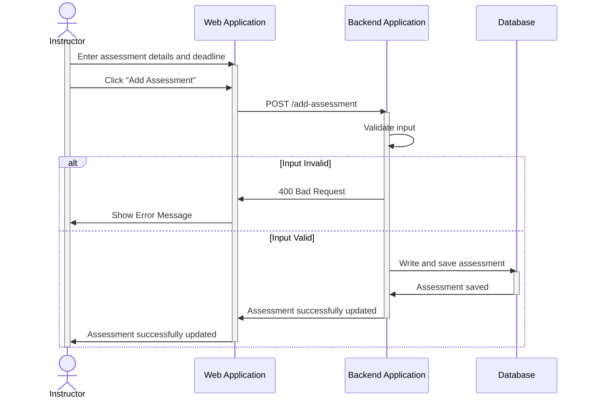

```mermaid
sequenceDiagram
    actor Instructor
    participant WA as Web Application
    participant BA as Backend Application
    participant Database

    activate Instructor
    Instructor->>WA: Enter assessment details and deadline
    activate WA
    Instructor->>WA: Click "Add Assessment"
    WA->>BA: POST /add-assessment

    activate BA
    BA->>BA: Validate input

    alt Input Invalid
        BA->>WA: 400 Bad Request
        WA->>Instructor: Show Error Message
    else Input Valid
        BA->>Database: Write and save assessment
        activate Database
        Database->>BA: Assessment saved
        deactivate Database

        BA->>WA: Assessment successfully updated

        deactivate BA

        WA->>Instructor: Assessment successfully updated
        deactivate WA
    end
    deactivate Instructor

```
