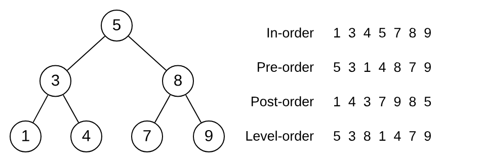

# Sorting, ADTs, Binary Search Trees

## Sorting Algorithms

### Motivation (Sorting Algorithms)

- Sorting provides structure to a list or collection providing useful arrangements.
  - Real life examples include sorting a class roll by alphabetical order or a list of scores in increasing order.
  - These give an ordered structure to allow for faster searching (in terms of algorithms, think binary search).

### Properties of Sorting Algorithms

#### Stability

- A stable sort preserves the relative order of items with equal keys.
- A stable sorting algorithm always performs a stable sort.
- Example: Consider the following simple table of enrolments, sorted by course code:

    

  | **course** | **name** | **program** |
  | ---------- | -------- | ----------- |
  | COMP2521   | Jane     | 3970        |
  | COMP2521   | John     | 3978        |
  | COMP2521   | Pete     | 3978        |
  | MATH1231   | John     | 3978        |
  | MATH1231   | Adam     | 3970        |
  | PSYC1011   | Adam     | 3970        |
  | PSYC1011   | Jane     | 3970        |

    

  Now we wish to sort it by student name, so that we can easily see what courses each student is studying. Show an example of what the final array would look like if

  1. we used a _stable_ sorting algorithm

  | **course** | **name** | **program** |
  | ---------- | -------- | ----------- |
  | MATH1231   | Adam     | 3970        |
  | PSYC1011   | Adam     | 3970        |
  | COMP2521   | Jane     | 3970        |
  | PSYC1011   | Jane     | 3970        |
  | COMP2521   | John     | 3978        |
  | MATH1231   | John     | 3978        |
  | COMP2521   | Pete     | 3978        |

  2. we used an _unstable_ sorting algorithm

  | **course** | **name** | **program** |
  | ---------- | -------- | ----------- |
  | PSYC1011   | Adam     | 3970        |
  | MATH1231   | Adam     | 3970        |
  | PSYC1011   | Jane     | 3970        |
  | COMP2521   | Jane     | 3970        |
  | COMP2521   | John     | 3978        |
  | MATH1231   | John     | 3978        |
  | COMP2521   | Pete     | 3978        |

#### Adaptability

- An `adaptive` sorting algorithm takes advantage of existing order in its input
  - The nature of the algorithm allows sorted or nearly-sorted inputs to be sorted much quicker than other input.
- Example: Bubble sort on sorted inputs runs in $O(n)$ time, however in reverse-sorted inputs will run in $O(n^2)$ time.

#### In-Place

- An `in-place` sorting algorithm sorts the data within the original structure, without using temporary arrays.

#### Elementary Sorts

| Algorithm      | Best     | Average  | Worst    | Stable | Adaptive |
| -------------- | -------- | -------- | -------- | ------ | -------- |
| Selection sort | $O(n^2)$ | $O(n^2)$ | $O(n^2)$ | No     | No       |
| Bubble sort    | $O(n)$   | $O(n^2)$ | $O(n^2)$ | Yes    | Yes      |
| Insertion sort | $O(n)$   | $O(n^2)$ | $O(n^2)$ | Yes    | Yes      |

#### Divide-and-Conquer Sorts

| Algorithm  | Best          | Average       | Worst         | Stable | Adaptive |
| ---------- | ------------- | ------------- | ------------- | ------ | -------- |
| Merge sort | $O(n\log n)$  | $O(n \log n)$ | $O(n \log n)$ | Yes    | No       |
| Quick sort | $O(n \log n)$ | $O(n \log n)$ | $O(n^2)$      | No     | No       |

  

## Abstract Data Types (ADTs)

An abstract data type is a conceptual model that defines a set of operations for a data structure without specifying how these operations are implemented or how data is stored in memory.

### Stack (LIFO - Last In First Out)

Think about a stack of cards while playing UNO. When you want to draw from the pile you take from the top. This is the same as the data structure which supports two main operations:

- **Push**, which adds an element to the stack and
- **Pop**, which removes the most recently added element.

### Queue (FIFO - First In First Out)

Think about a queue at the bank, the first person who enters the line first will be served first. It supports two main operations:

- **Enqueue**, which adds one element to the rear of the queue
- **Dequeue**, which removes one element from the front of the queue.

> Example: A classic problem in computer science is the problem of implementing a queue using two stacks. Consider the following [stack ADT interface](./Stack.h). Use the stack ADT interface to complete the implementation of the [queue ADT](./Queue.c).

## Binary Search Trees (BSTs)

- A **tree** is a hierarchical data structure consisting of a set of connected nodes where each node may have multiple other nodes as children and each node is connected to one parent (except the root node).
- A **binary tree** is a tree where each node can have up to two child nodes.
- A **binary search tree** is an ordered binary tree, where for each node:
  - All values in the left subtree are less than the value in the node
  - All values in the right subtree are greater than the value in the node

### Motivation (BSTs)

Binary search trees are efficient to search and maintain:

- Searching in a binary search tree is similar to how binary search works
- A binary search tree is a linked data structure (like a linked list), so there
  is no need to shift elements when inserting/deleting

### Basic Operations

- **Insertion** - $O(\log n)$
  - Start at the root
  - Compare value to be inserted with value in the node
    - If value being inserted is less, descend to left child
    - If value being inserted is greater, descend to right child
  - Repeat until you have to go left/right but current node has no left/right child
    - Create new node and attach to current node
- **Search** - $O(\log n)$
  - Start at the root and compare target with current node's value
  - If target is less, recursively call on left child
  - If target is greater, recursively call on right child.
  - If equal return found, otherwise continue until search is exhausted and return not found.
- **Deletion** - $O(\log n)$
  - Node has no children (leaf node), just remove the node
  - Node has one child - remove the node and replace node with child
  - Node has two children - replace node with either max value in the left subtree or min value in the right subtree

### Traversals

- Pre-order (NLR): visit root, then traverse left subtree, then traverse right subtree
- In-order(LNR): traverse left subtree, then visit root, then traverse right subtree
- Post-order (LRN): traverse left subtree, then traverse right subtree, then visit root
- Level-order: visit root, then its children, then their children, and so on

  

### Exercises

Solutions to the following coding exercises can be found [here](./bst.c).

1. Implement a function that counts the number of odd values in a tree.
2. Implement a function to count number of internal nodes in a given tree. An internal node is a node with at least one child node.
3. Implement a function that returns the level of the node containing a given key if such a node exists, otherwise the function returns -1. The level of the root node is zero.
4. Implement a function that counts the number of values that are greater than a given value. This function should avoid visiting nodes it doesn't have to visit.
